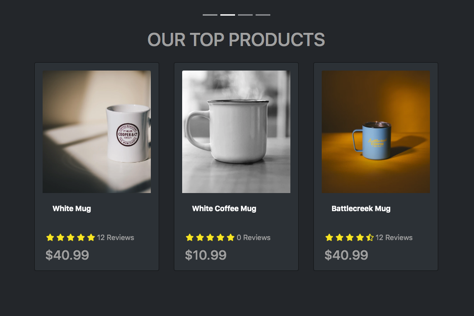

# Blog and photo gallery

> This is a [MugShop e-commerce](https://mernstack-blog.herokuapp.com/ 'blog and photo gallery app') build with the MERN stack & Redux.



## Features

- Landing page.
- Shopping cart.
- Product search feature.
- Top products carousel.
- Product pagination.
- User profile and orders.
- Admin product and user managment.
- Order details page.
- Checkout process(shipping, payment method etc)
- Paypal/credit integration.
- Database seeder for products and users

## Usage

1. You should install [docker](https://docs.docker.com/get-docker/) to be able to provision the database.
1. On linux you might need to install [docker-compose](https://docs.docker.com/compose/install/) as well.
1. This project uses [npm](https://www.npmjs.com/) package manager.

## Env Variables

Create your .env file in the root of the repo, make use of the variables in the .env.example file.

###

## Install Dependencies (backend & client)

```bash
npm install
cd client
npm install
```

## Run

```
 # Run client (:3000) & backend (:5000)
 npm run dev

 # Run backend only
 npm run server
```

### For the backend:

1. You can run the database by running docker-compose up
1. You terminate mongoDB server docker-compose down
1. ### Seed Database:

   You can use the following to seed the database with some sample users, blogs and images as well as destroy all data.

   ```
   # Import data
   npm run data:import

   # Destroy data
   npm run data:destroy
   ```

   ```
   Sample user admin Login

   admin@example.com(com) (Admin)
   123456
   ```

   ## Testing checkout process:

   - You can use your own [paypal sandbox account ](https://developer.paypal.com/developer/accounts/) if you want to test the checkout process.
